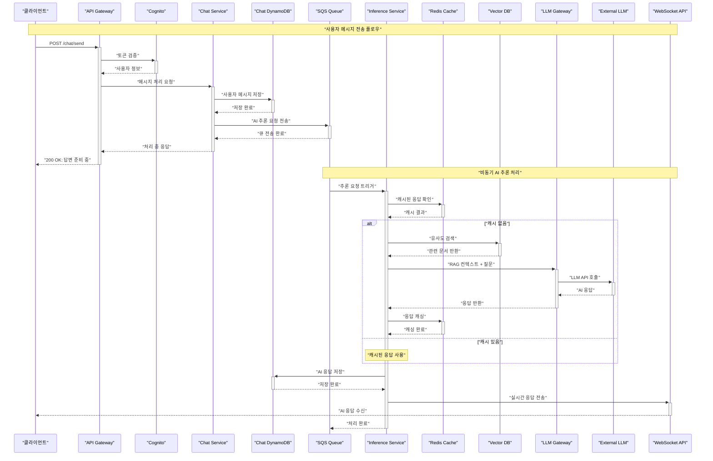
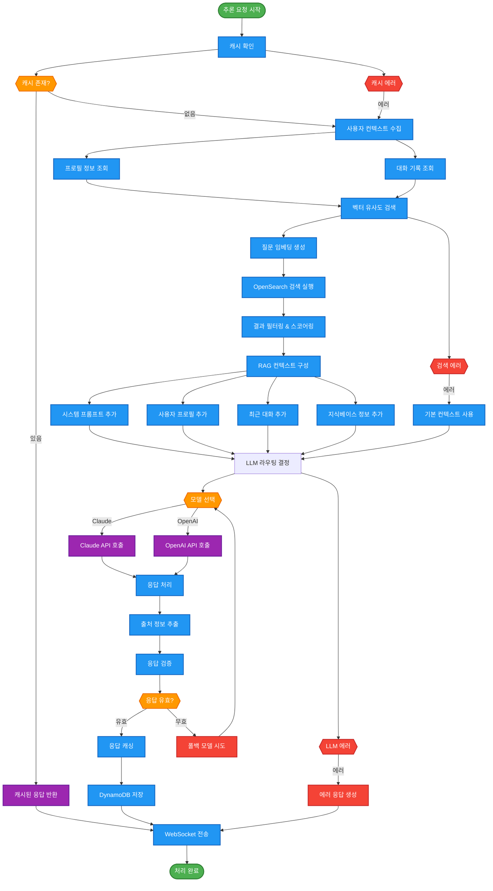
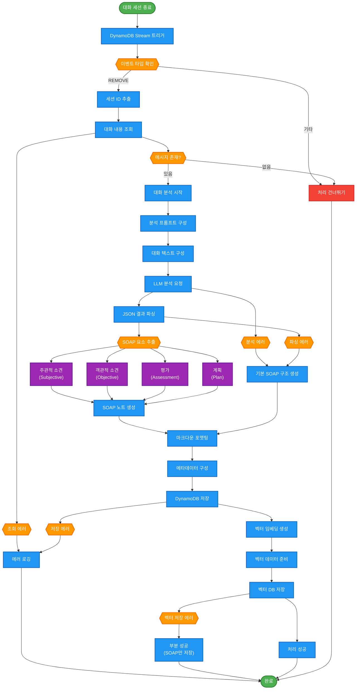
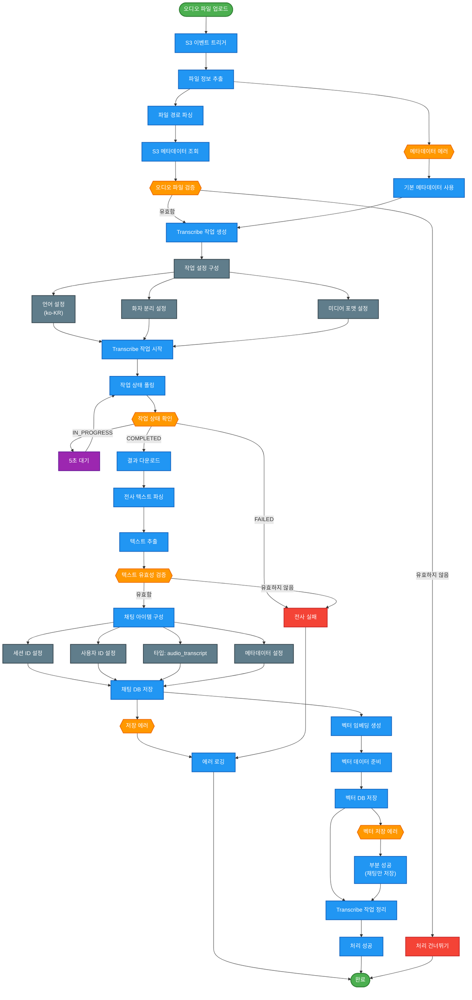
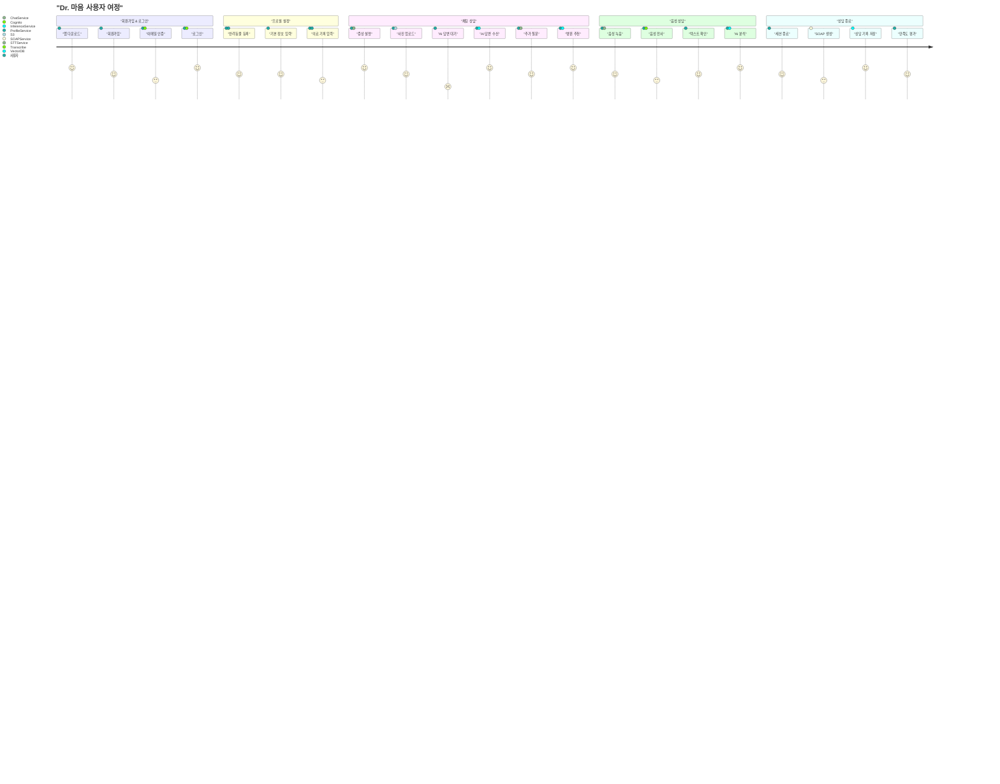
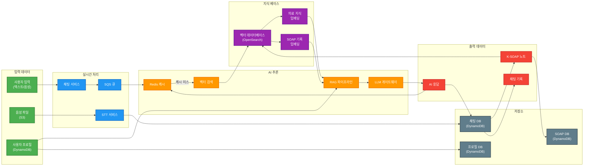

# "Dr. 마음" 백엔드 시스템 아키텍처 다이어그램

## 1. 전체 시스템 아키텍처 다이어그램

```mermaid
graph TB
    subgraph "클라이언트 레이어"
        Mobile["모바일 앱"]
        Web["웹 앱"]
    end

    subgraph "API 게이트웨이 레이어"
        APIGW["API Gateway<br/>(REST API)"]
        WSGW["API Gateway<br/>(WebSocket)"]
    end

    subgraph "인증 레이어"
        Cognito["Amazon Cognito<br/>사용자 인증"]
    end

    subgraph "마이크로서비스 레이어"
        AuthLambda["Auth Service<br/>(Lambda)"]
        ProfileLambda["Profile Service<br/>(Lambda)"]
        ChatLambda["Chat Service<br/>(Lambda)"]
        WSLambda["WebSocket Handler<br/>(Lambda)"]
        InferenceLambda["Inference Service<br/>(Lambda)"]
        SoapLambda["SOAP Generator<br/>(Lambda)"]
        STTLambda["STT Processor<br/>(Lambda)"]
    end

    subgraph "메시징 & 큐"
        SQS["Amazon SQS<br/>추론 요청 큐"]
        DLQ["Dead Letter Queue"]
    end

    subgraph "오케스트레이션"
        StepFunc["Step Functions<br/>RAG 파이프라인"]
    end

    subgraph "캐싱 레이어"
        Redis["ElastiCache<br/>Redis Cluster"]
    end

    subgraph "데이터베이스 레이어"
        ChatDB["DynamoDB<br/>채팅 테이블"]
        ProfileDB["DynamoDB<br/>프로필 테이블"]
        SoapDB["DynamoDB<br/>SOAP 테이블"]
    end

    subgraph "벡터 데이터베이스"
        OpenSearch["OpenSearch<br/>Serverless<br/>벡터 검색"]
    end

    subgraph "스토리지"
        S3["S3 Bucket<br/>오디오 파일"]
    end

    subgraph "외부 서비스"
        OpenAI["OpenAI API"]
        Claude["Claude API"]
        Transcribe["Amazon Transcribe"]
    end

    subgraph "보안"
        Secrets["Secrets Manager<br/>API 키 관리"]
        IAM["IAM Roles<br/>권한 관리"]
    end

    subgraph "모니터링"
        CloudWatch["CloudWatch<br/>로깅 & 메트릭"]
        XRay["X-Ray<br/>분산 추적"]
    end

    %% 연결 관계
    Mobile --> APIGW
    Web --> APIGW
    Mobile --> WSGW
    Web --> WSGW

    APIGW --> Cognito
    APIGW --> AuthLambda
    APIGW --> ProfileLambda
    APIGW --> ChatLambda

    WSGW --> WSLambda

    AuthLambda --> Cognito
    ProfileLambda --> ProfileDB
    ChatLambda --> ChatDB
    ChatLambda --> SQS

    SQS --> InferenceLambda
    SQS --> DLQ

    InferenceLambda --> StepFunc
    InferenceLambda --> Redis
    InferenceLambda --> OpenSearch
    InferenceLambda --> WSGW

    StepFunc --> OpenAI
    StepFunc --> Claude
    StepFunc --> Secrets

    ChatDB --> SoapLambda
    SoapLambda --> SoapDB
    SoapLambda --> OpenSearch

    S3 --> STTLambda
    STTLambda --> Transcribe
    STTLambda --> ChatDB
    STTLambda --> OpenSearch

    %% 모니터링 연결
    AuthLambda -.-> CloudWatch
    ProfileLambda -.-> CloudWatch
    ChatLambda -.-> CloudWatch
    InferenceLambda -.-> CloudWatch
    SoapLambda -.-> CloudWatch
    STTLambda -.-> CloudWatch

    AuthLambda -.-> XRay
    ProfileLambda -.-> XRay
    ChatLambda -.-> XRay
    InferenceLambda -.-> XRay

    %% 스타일링
    classDef lambdaStyle fill:#FF9900,stroke:#232F3E,stroke-width:2px,color:#FFFFFF
    classDef dbStyle fill:#3F48CC,stroke:#232F3E,stroke-width:2px,color:#FFFFFF
    classDef apiStyle fill:#FF4B4B,stroke:#232F3E,stroke-width:2px,color:#FFFFFF
    classDef cacheStyle fill:#C925D1,stroke:#232F3E,stroke-width:2px,color:#FFFFFF
    classDef externalStyle fill:#146EB4,stroke:#232F3E,stroke-width:2px,color:#FFFFFF

    class AuthLambda,ProfileLambda,ChatLambda,WSLambda,InferenceLambda,SoapLambda,STTLambda lambdaStyle
    class ChatDB,ProfileDB,SoapDB,OpenSearch dbStyle
    class APIGW,WSGW apiStyle
    class Redis cacheStyle
    class OpenAI,Claude,Transcribe externalStyle
```

## 2. 채팅 메시지 처리 시퀀스 다이어그램

## 3. RAG 파이프라인 상세 플로우 다이어그램

## 4. K-SOAP 생성 워크플로우 다이어그램

## 5. STT 처리 워크플로우 다이어그램

## 6. CI/CD 파이프라인 다이어그램

```mermaid
flowchart TD
    subgraph "소스 관리"
        Dev["개발자"]
        GitHub["GitHub Repository"]
    end
    
    subgraph "CI/CD 파이프라인"
        Pipeline["CodePipeline"]
        
        subgraph "소스 스테이지"
            Source["Source Action<br/>GitHub Integration"]
        end
        
        subgraph "빌드 스테이지"
            Build["CodeBuild Project"]
            subgraph "빌드 작업"
                Test["유닛 테스트<br/>pytest"]
                SAMBuild["SAM Build<br/>컨테이너 빌드"]
                Validate["템플릿 검증<br/>sam validate"]
                Package["패키징<br/>CloudFormation"]
            end
        end
        
        subgraph "개발 배포 스테이지"
            DevDeploy["Development Deploy"]
            subgraph "개발 환경 배포"
                CreateCS["Change Set 생성"]
                ExecuteCS["Change Set 실행"]
                DevStack["dev 스택 배포"]
            end
        end
        
        subgraph "승인 스테이지"
            Approval["Manual Approval<br/>수동 승인"]
        end
        
        subgraph "운영 배포 스테이지"
            ProdDeploy["Production Deploy"]
            subgraph "운영 환경 배포"
                CreateProdCS["Change Set 생성"]
                ExecuteProdCS["Change Set 실행"]
                ProdStack["prod 스택 배포"]
            end
        end
    end
    
    subgraph "인프라 자원"
        DevInfra["개발 환경<br/>AWS 리소스"]
        ProdInfra["운영 환경<br/>AWS 리소스"]
    end
    
    subgraph "모니터링"
        CloudWatch["CloudWatch<br/>로깅 & 메트릭"]
        XRay["X-Ray<br/>분산 추적"]
        Alarms["CloudWatch Alarms<br/>알람 & 알림"]
    end
    
    %% 워크플로우 연결
    Dev --> GitHub
    GitHub --> Source
    Source --> Build
    
    Build --> Test
    Test --> SAMBuild
    SAMBuild --> Validate
    Validate --> Package
    
    Package --> DevDeploy
    DevDeploy --> CreateCS
    CreateCS --> ExecuteCS
    ExecuteCS --> DevStack
    
    DevStack --> Approval
    Approval --> ProdDeploy
    
    ProdDeploy --> CreateProdCS
    CreateProdCS --> ExecuteProdCS
    ExecuteProdCS --> ProdStack
    
    %% 배포 대상 연결
    DevStack --> DevInfra
    ProdStack --> ProdInfra
    
    %% 모니터링 연결
    DevInfra -.-> CloudWatch
    ProdInfra -.-> CloudWatch
    DevInfra -.-> XRay
    ProdInfra -.-> XRay
    CloudWatch --> Alarms
    
    %% 실패 시 롤백 (점선)
    ExecuteCS -.->|"실패 시"| DevStack
    ExecuteProdCS -.->|"실패 시"| ProdStack
    
    %% 피드백 루프 (점선)
    Alarms -.->|"알람 발생"| Dev
    
    %% 스타일링
    classDef developer fill:#4CAF50,stroke:#2E7D32,stroke-width:2px,color:#FFFFFF
    classDef pipeline fill:#2196F3,stroke:#1565C0,stroke-width:2px,color:#FFFFFF
    classDef build fill:#FF9800,stroke:#EF6C00,stroke-width:2px,color:#FFFFFF
    classDef deploy fill:#9C27B0,stroke:#6A1B9A,stroke-width:2px,color:#FFFFFF
    classDef infra fill:#607D8B,stroke:#37474F,stroke-width:2px,color:#FFFFFF
    classDef monitor fill:#F44336,stroke:#C62828,stroke-width:2px,color:#FFFFFF
    
    class Dev,GitHub developer
    class Pipeline,Source pipeline
    class Build,Test,SAMBuild,Validate,Package build
    class DevDeploy,CreateCS,ExecuteCS,DevStack,ProdDeploy,CreateProdCS,ExecuteProdCS,ProdStack,Approval deploy
    class DevInfra,ProdInfra infra
    class CloudWatch,XRay,Alarms monitor
```

## 7. 사용자 여정 플로우 다이어그램

## 8. 데이터 플로우 다이어그램

이러한 다이어그램들은 "Dr. 마음" 백엔드 시스템의 전체 아키텍처와 데이터 플로우를 시각적으로 명확하게 보여줍니다. 각 다이어그램은 시스템의 다른 관점을 제공하며, 개발팀과 스테이크홀더들이 시스템을 이해하고 의사소통하는데 도움이 됩니다.

